 

# 🛠 Tech Stack

**Language**

**MCU / Hardware**

**Protocol / Interface**

**OS / Framework**

**Tools**

 

# 🚀 Projects

## Firmware

| 프로젝트 | 설명 | 태그 | 링크 |
|---|---|---|---|
| AC Auto Controller | 차량 데이터 기반 지능형 에어컨 부하 제어 모듈 | `C` `ESP32` `CAN` `FreeRTOS` `PCB` |   (X) |
| KIA Mohave AC Status Module | 모하비 공조 신호 파싱 및 안드로이드 올인원 공조기 상태 표시 | `C` `ATmega` `ESP32` `STM32` `UART` `SPI` `PCB` |   (X) |
| STM32F103_Doorlock_IoT | UART 패킷 분석을 통한 도어락 IoT 원격 제어 | `C` `STM32` `ESP AT` `UART` `Bluetooth` `Wi-Fi` `Reverse Engineering` |    (X) |
| STM32_BSP_CLI | UART 기반 CLI 모듈 | `C` `STM32` `CMake` `UART` `DMA` |   |
| STM32F103RB_NUCLEO_BSP | STM32F103RB Nucleo 보드용 BSP | `C` `STM32` `CMake` `HAL` `UART` `DMA` |  |
| STM32_BSP_DRONE | (드론 프로젝트 진행 중) | `C` `STM32` `CMake` `HAL` `TIM` `UART` `Motor Control` `BMI270` `Lo-Ra` | (X) |

<!--  -->

<!--  -->

<!--  -->

<!--  -->

## System Software

| 프로젝트 | 설명 | 태그 | 링크 |
|---|---|---|---|
| Buildroot_RPi5_Qt_GUI | Buildroot 기반 커스텀 리눅스 환경 구축 및 Qt 디지털 계기판 | `C++` `Qt` `QML` `Buildroot` `Embedded Linux` `CAN` `SPI` |    (X) |

 

# 📡 Links

 

<!--  -->

