# 🐙 Git 업무 워크플로우 가이드

> Git 초보자를 위한 상황별 명령어 흐름도 + 비상 매뉴얼

---

## 📌 목차

1. [시작하기 — init vs clone](#1-시작하기--init-vs-clone)
2. [서브모듈 — Submodule](#2-서브모듈--submodule)
3. [환경 설정](#3-환경-설정)
4. [기본 작업 흐름 — 스테이징 & 커밋](#4-기본-작업-흐름--스테이징--커밋)
5. [브랜치 작업 흐름](#5-브랜치-작업-흐름)
6. [원격 저장소 동기화](#6-원격-저장소-동기화)
7. [임시 저장 — Stash](#7-임시-저장--stash)
8. [충돌(Conflict) 해결](#8-충돌conflict-해결)
9. [로그 & 검색](#9-로그--검색)
10. [태그 & 릴리즈](#10-태그--릴리즈)
11. [Pull Request 흐름](#11-pull-request-흐름)
12. [🚨 비상 매뉴얼](#12--비상-매뉴얼)

---

## 1. 시작하기 — init vs clone

> 모든 Git 작업은 여기서 시작합니다

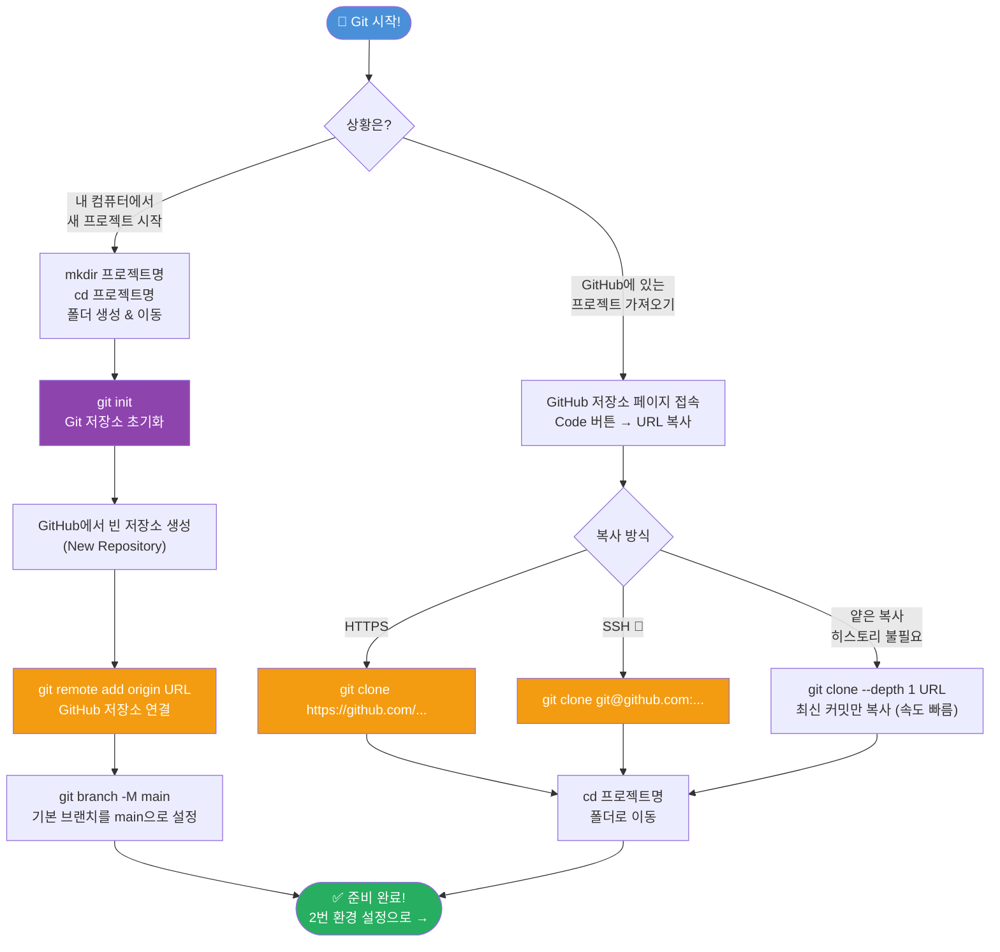

### 💡 init vs clone 한눈에 비교

| | `git init` | `git clone` |
|---|---|---|
| **언제?** | 새 프로젝트를 처음 시작할 때 | 이미 있는 원격 저장소를 받아올 때 |
| **결과** | 빈 `.git` 폴더 생성 | 코드 + 전체 히스토리 복사 |
| **추가 작업** | `git remote add`로 GitHub 연결 필요 | 자동으로 origin 연결됨 |

### 🚨 init/clone 비상 매뉴얼

```bash
# ❌ 잘못된 폴더에서 git init 해버렸다!
rm -rf .git                              # .git 폴더 삭제로 Git 제거 ⚠️ 복구 불가

# ❌ git remote를 잘못된 URL로 연결했다!
git remote -v                            # 현재 연결된 URL 확인
git remote set-url origin 새URL         # URL 수정

# ❌ clone 했는데 특정 브랜치가 없다!
git branch -r                            # 원격 브랜치 목록 확인
git checkout -b 브랜치명 origin/브랜치명  # 원격 브랜치를 로컬로 가져오기
```

---

## 2. 서브모듈 — Submodule

> 하나의 Git 저장소 안에 다른 Git 저장소를 포함시키는 기능

### 💡 서브모듈이 필요한 대표 상황

| 상황 | 예시 |
|------|------|
| **공통 라이브러리 공유** | 여러 프로젝트에서 쓰는 UI 컴포넌트, 유틸 함수 |
| **외부 의존성 직접 관리** | npm/pip 대신 특정 버전의 오픈소스를 소스째로 포함 |
| **모노레포 대신 멀티레포** | 백엔드·프론트엔드를 각자 저장소로 관리하되 하나로 묶기 |
| **테마 / 플러그인 분리** | Hugo 테마, Vim 플러그인처럼 독립 배포되는 모듈 |
| **설정 파일 공유** | dotfiles, ESLint 규칙 등 팀 공통 설정 저장소 |

---

### 2-1. 서브모듈이 있는 프로젝트 clone

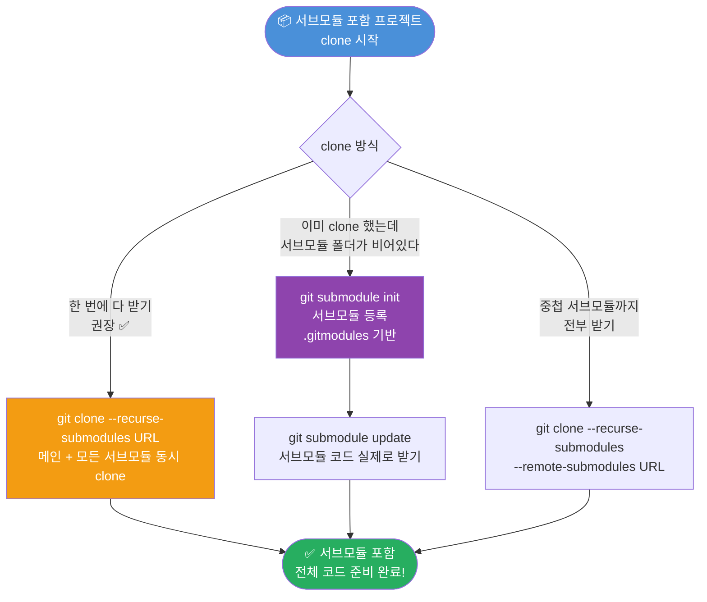

---

### 2-2. 기존 프로젝트에 서브모듈 추가

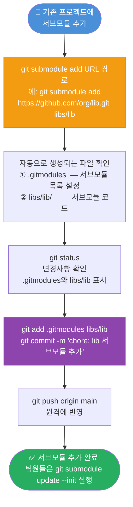

---

### 2-3. 서브모듈 업데이트 & 일상 작업 흐름

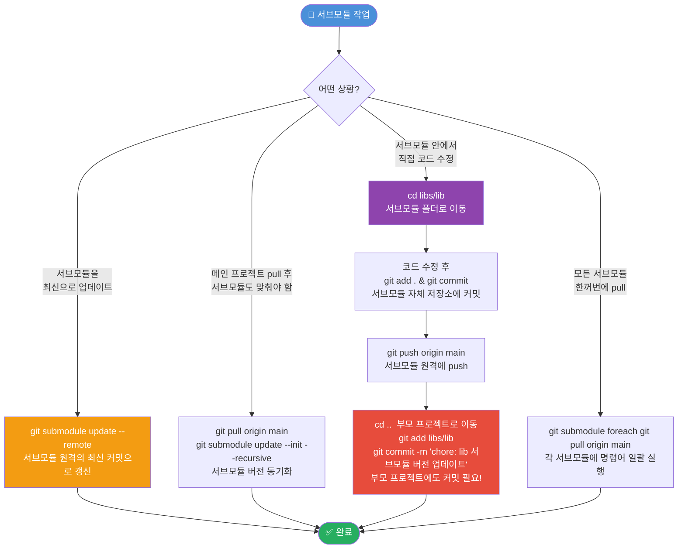

### ⚠️ 서브모듈의 핵심 개념

```
부모 저장소는 서브모듈의 "특정 커밋 해시"만 기록합니다.
서브모듈 코드 자체를 저장하는 게 아닙니다!

부모 저장소
└── .gitmodules          ← 서브모듈 URL, 경로 설정
└── libs/lib/            ← 서브모듈 폴더 (특정 커밋 해시 포인터)
    └── .git/            ← 서브모듈 자체의 Git 저장소

⚠️ 서브모듈 코드를 수정하면 반드시:
  1. 서브모듈 자체 저장소에 commit + push
  2. 부모 저장소에도 commit + push (버전 포인터 업데이트)
```

### 💡 서브모듈 주요 명령어 요약

```bash
# ➕ 추가
git submodule add URL                        # 서브모듈 추가 (루트에)
git submodule add URL 경로/이름             # 경로 지정해서 추가

# 📥 받기
git clone --recurse-submodules URL           # clone 시 서브모듈 포함
git submodule init                           # 서브모듈 등록 (.gitmodules 기반)
git submodule update                         # 서브모듈 코드 다운로드
git submodule update --init --recursive      # 중첩 서브모듈까지 전부

# 🔄 업데이트
git submodule update --remote               # 서브모듈 최신 커밋으로 갱신
git submodule foreach git pull origin main  # 전체 서브모듈 일괄 pull

# 📋 확인
git submodule status                         # 서브모듈 상태 확인
git submodule                                # 간단 목록

# 🗑️ 제거 (4단계 필요!)
git submodule deinit -f 경로               # 서브모듈 등록 해제
git rm -f 경로                              # 서브모듈 폴더 제거
rm -rf .git/modules/경로                   # .git 내부 캐시 삭제
git commit -m "chore: 서브모듈 제거"       # 변경사항 커밋
```

### 🚨 서브모듈 비상 매뉴얼

```bash
# ❌ clone 후 서브모듈 폴더가 텅 비어있다!
git submodule update --init --recursive    # 서브모듈 초기화 + 코드 받기

# ❌ 팀원이 서브모듈을 추가했는데 나한테는 안 보인다!
git pull origin main
git submodule update --init --recursive   # 새로 추가된 서브모듈 포함해서 초기화

# ❌ 서브모듈이 "detached HEAD" 상태다!
# 서브모듈은 기본적으로 detached HEAD가 정상입니다
# 직접 수정하려면:
cd 서브모듈경로
git checkout main                         # 브랜치로 이동 후 작업

# ❌ 서브모듈 URL이 바뀌었다!
# .gitmodules 파일에서 URL 직접 수정 후:
git submodule sync                        # .gitmodules → .git/config 동기화
git submodule update --init              # 새 URL로 다시 받기

# ❌ 서브모듈 변경사항을 push 했는데 부모 프로젝트가 없는 커밋을 가리킨다!
# (서브모듈 push 전에 부모를 push해서 생기는 문제 방지)
git push --recurse-submodules=check      # 서브모듈 push 안 됐으면 경고
git push --recurse-submodules=on-demand  # 서브모듈 자동으로 먼저 push ✅
```

---

## 3. 환경 설정

> 처음 한 번만 설정하면 됩니다

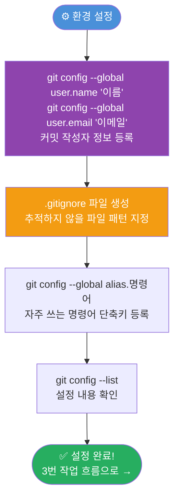

### 💡 주요 설정 명령어

```bash
# 👤 사용자 정보 (커밋에 표시됨 — 필수!)
git config --global user.name "홍길동"
git config --global user.email "gildong@email.com"
git config --list                            # 전체 설정 확인

# ⚡ 자주 쓰는 alias 단축키 등록
git config --global alias.st status         # git st → git status
git config --global alias.co checkout       # git co → git checkout
git config --global alias.lg "log --oneline --graph --all"  # git lg

# 🔧 기타 유용한 설정
git config --global core.editor "code --wait"  # VSCode를 기본 에디터로
git config --global pull.rebase false           # pull 시 merge 방식 사용
```

### 📄 .gitignore 주요 패턴

```gitignore
# 의존성 폴더
node_modules/
vendor/

# 환경 변수 / 비밀 파일 (⚠️ 절대 올리면 안 됨!)
.env
.env.local
*.pem

# 빌드 결과물
dist/
build/
*.log

# OS 파일
.DS_Store
Thumbs.db
```

> 💡 **[gitignore.io](https://gitignore.io)** 에서 언어/프레임워크별 .gitignore를 자동 생성할 수 있습니다.

### 🚨 설정 비상 매뉴얼

```bash
# ❌ .gitignore를 나중에 추가했는데 이미 추적 중인 파일이 있다!
git rm --cached 파일명               # 추적에서만 제거 (파일은 유지)
git rm --cached -r 폴더명/          # 폴더째로 추적 해제
git commit -m "chore: gitignore 적용"

# ❌ 민감한 파일(.env 등)을 실수로 push해버렸다!
# 1단계: 즉시 API키/비밀번호 재발급! (보안 조치 먼저)
# 2단계: BFG Repo Cleaner로 히스토리에서 완전 삭제
# 3단계: .gitignore에 추가 후 재발생 방지
```

---

## 4. 기본 작업 흐름 — 스테이징 & 커밋

> 파일을 수정하고 GitHub에 올리는 가장 기본적인 흐름

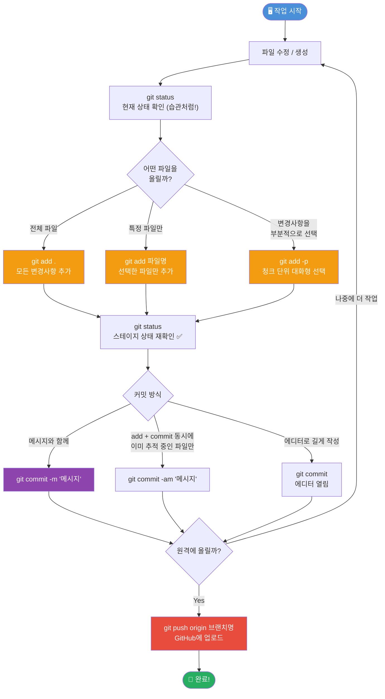

### 💡 커밋 메시지 컨벤션

| 타입 | 의미 | 예시 |
|------|------|------|
| `feat:` | 새 기능 | `feat: 로그인 기능 추가` |
| `fix:` | 버그 수정 | `fix: 비밀번호 검증 오류 수정` |
| `docs:` | 문서 수정 | `docs: README 업데이트` |
| `style:` | 코드 포맷 변경 | `style: 들여쓰기 정리` |
| `refactor:` | 코드 리팩토링 | `refactor: 인증 로직 분리` |
| `chore:` | 설정, 빌드 등 기타 | `chore: 패키지 버전 업데이트` |

### 🚨 스테이징 & 커밋 비상 매뉴얼

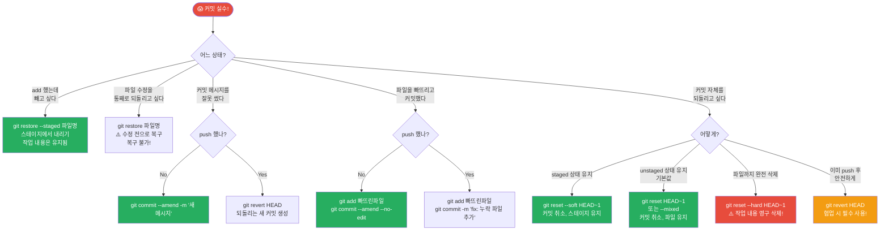

### 💡 reset 세 가지 비교

| 옵션 | 커밋 취소 | 스테이지 | 파일 내용 | 언제? |
|------|-----------|----------|-----------|-------|
| `--soft` | ✅ | 유지 (staged) | 유지 | 메시지만 바꿔서 재커밋 |
| `--mixed` (기본) | ✅ | 초기화 | 유지 | 파일 다시 수정 후 재커밋 |
| `--hard` | ✅ | 초기화 | **삭제** ⚠️ | 완전히 없애고 싶을 때 |

---

## 5. 브랜치 작업 흐름

> 새로운 기능 개발 시 브랜치를 나눠서 작업하는 흐름

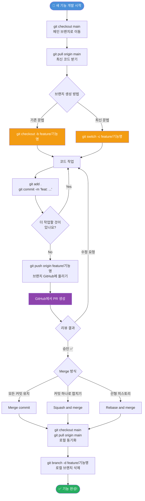

### 💡 브랜치 명령어 요약

| 명령어 | 설명 |
|--------|------|
| `git branch` | 브랜치 목록 확인 |
| `git branch -v` | 브랜치 + 마지막 커밋 확인 |
| `git checkout -b 브랜치명` | 새 브랜치 만들고 이동 (기존) |
| `git switch -c 브랜치명` | 새 브랜치 만들고 이동 (최신) |
| `git branch -m 새이름` | 현재 브랜치 이름 변경 |
| `git branch -d 브랜치명` | 브랜치 삭제 (병합된 것만) |
| `git branch -D 브랜치명` | 브랜치 강제 삭제 |
| `git push origin --delete 브랜치명` | 원격 브랜치 삭제 |
| `git rebase -i HEAD~3` | 최근 3개 커밋 대화형 편집 |

### 🚨 브랜치 비상 매뉴얼

```bash
# ❌ 브랜치를 main에서 안 따고 엉뚱한 브랜치에서 땄다!
git log --oneline                          # 현재 커밋 해시 확인
git checkout main
git cherry-pick 커밋해시                    # 원하는 커밋만 가져오기
git checkout 잘못된브랜치
git reset HEAD~1                           # 잘못된 브랜치에서 커밋 제거

# ❌ 브랜치를 삭제했는데 복구하고 싶다!
git reflog                                 # 삭제된 브랜치의 마지막 커밋 해시 찾기
git checkout -b 브랜치명 커밋해시           # 해당 커밋으로 브랜치 복구

# ❌ rebase 도중 충돌이 나거나 취소하고 싶다!
git rebase --abort                         # rebase 완전 취소
git rebase --continue                      # 충돌 해결 후 rebase 재개
git rebase --skip                          # 현재 커밋 건너뛰기

# ❌ 공유 브랜치에서 rebase 했더니 팀원이 혼란스러워한다!
# 공유 브랜치(main, develop 등)에서는 rebase 절대 금지!
# 본인 feature 브랜치에서만 rebase 사용
```

---

## 6. 원격 저장소 동기화

> GitHub와 내 로컬 컴퓨터 코드를 맞추는 흐름

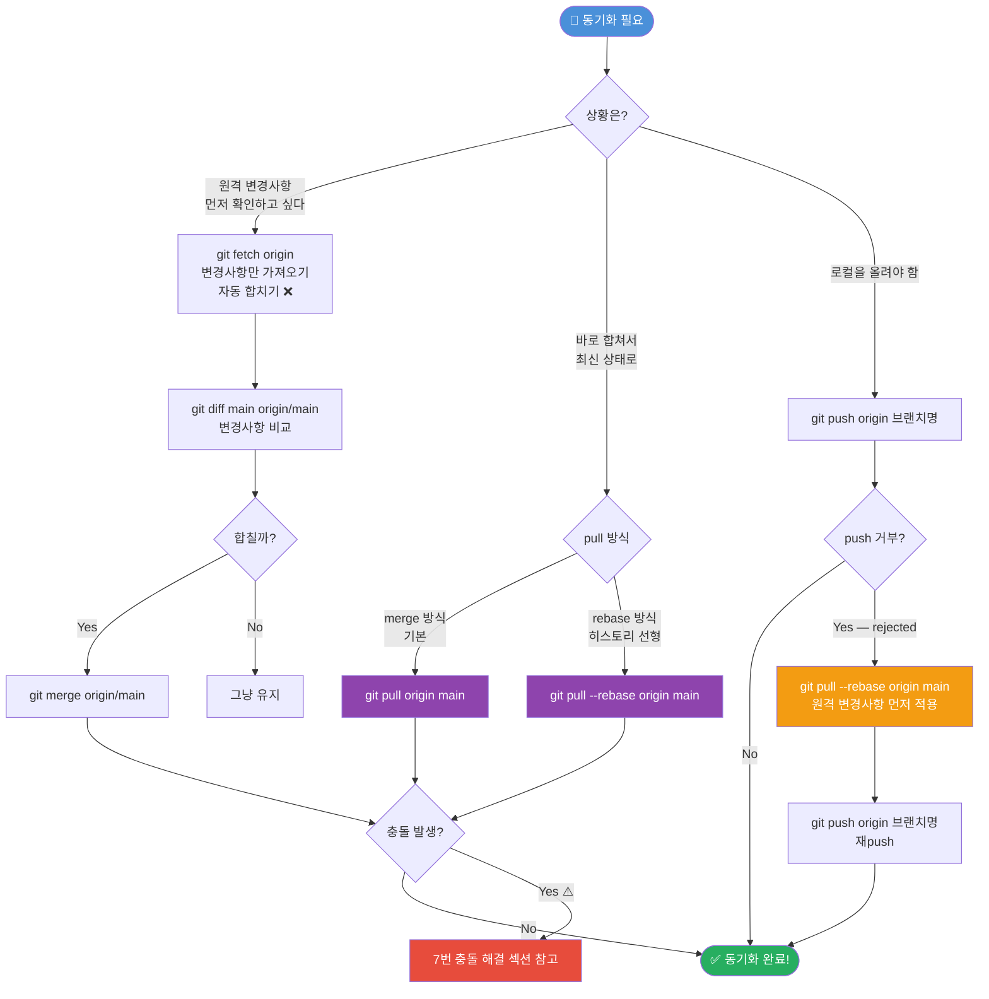

### 💡 fetch vs pull 차이

| | `git fetch` | `git pull` |
|---|---|---|
| **하는 일** | 원격 변경사항 다운로드만 | 다운로드 + 자동 merge |
| **내 코드** | 건드리지 않음 ✅ | 자동으로 합쳐짐 |
| **안전도** | 더 안전 | 충돌 날 수 있음 |
| **추천 상황** | 변경사항 먼저 확인하고 싶을 때 | 빠르게 최신화할 때 |

### 🚨 동기화 비상 매뉴얼

```bash
# ❌ pull 했는데 이상해졌다! 되돌리고 싶다!
git reset --hard ORIG_HEAD              # pull 직전 상태로 복구 (가장 빠른 방법!)
# 또는
git reflog                              # pull 이전 커밋 해시 확인
git reset --hard HEAD@{1}              # 한 단계 이전으로

# ❌ 내 작업 중인데 pull해야 한다!
git stash                               # 내 변경사항 임시 저장 (6번 섹션 참고)
git pull origin main
git stash pop                           # 내 변경사항 복원

# ❌ 원격 브랜치가 삭제됐는데 로컬에 계속 뜬다!
git fetch --prune                       # 삭제된 원격 브랜치 정보 정리

# ❌ push --force를 써야 할 것 같다!
git push --force-with-lease 브랜치명   # --force보다 안전한 강제 push
# ⚠️ --force는 팀 협업 브랜치에서 절대 금지!
```

---

## 7. 임시 저장 — Stash

> 커밋하지 않은 작업을 잠깐 서랍에 넣어두는 기능

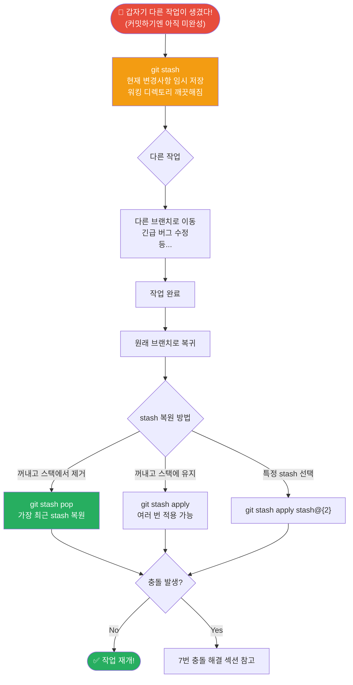

### 💡 stash 명령어 요약

```bash
# 📦 저장
git stash                             # 현재 변경사항 저장 (tracked 파일만)
git stash push -m "설명"             # 이름 붙여서 저장
git stash -u                          # untracked(새 파일)도 포함해서 저장

# 📋 확인
git stash list                        # 저장된 stash 목록 확인
# 출력 예: stash@{0}: WIP on main: 작업중

# 🔄 복원
git stash pop                         # 가장 최근 stash 복원 + 스택에서 제거
git stash apply                       # 복원하되 스택에 유지
git stash apply stash@{2}            # 특정 stash 복원

# 🗑️ 삭제
git stash drop stash@{0}             # 특정 stash 삭제
git stash clear                       # 전체 stash 삭제 ⚠️
```

---

## 8. 충돌(Conflict) 해결

> 같은 파일을 여러 명이 수정했을 때 충돌을 해결하는 흐름

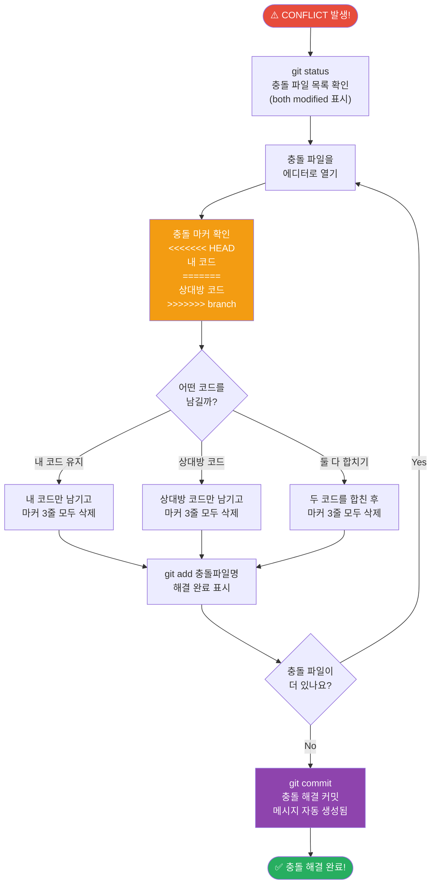

### 💡 충돌 마커 설명

```
<<<<<<< HEAD           ← 여기서부터 내 코드 (현재 브랜치)
console.log("Hello");
=======                ← 구분선
console.log("Hi");
>>>>>>> feature/abc    ← 여기까지 상대방 코드 (병합하려는 브랜치)
```

> ✅ 마커 3줄(`<<<<<<<`, `=======`, `>>>>>>>`)은 반드시 **모두** 삭제해야 합니다!

### 🚨 충돌 비상 매뉴얼

```bash
# ❌ 충돌 해결이 너무 복잡해서 merge 자체를 취소하고 싶다!
git merge --abort                     # merge 이전 상태로 완전히 복구

# ❌ rebase 중 충돌이 났다!
git rebase --abort                    # rebase 완전 취소
# 또는 충돌 해결 후
git add 충돌파일명
git rebase --continue                 # 충돌 해결하고 rebase 재개

# ❌ 충돌 해결하다 파일을 망쳤다!
git checkout HEAD -- 파일명           # 충돌 전 내 코드로 되돌리기
git checkout MERGE_HEAD -- 파일명    # 상대방 버전으로 되돌리기

# ❌ 어떤 커밋에서 충돌이 시작됐는지 모르겠다!
git log --merge                       # 충돌 관련 커밋 목록 확인
git diff ORIG_HEAD                    # merge 전후 변경사항 비교
```

---

## 9. 로그 & 검색

> 히스토리를 확인하고 문제의 원인을 추적하는 흐름

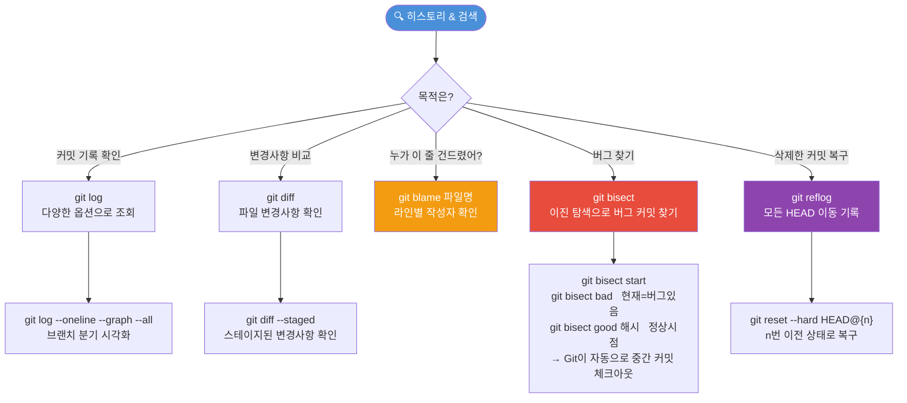

### 💡 로그 & 검색 명령어 모음

```bash
# 📋 git log — 커밋 히스토리 확인
git log                              # 전체 로그
git log --oneline                    # 한 줄 요약
git log --oneline --graph --all      # 브랜치 분기 그래프 ⭐
git log -p                           # 변경 내용(diff) 포함
git log --author="홍길동"            # 특정 작성자 필터
git log --since="2024-01-01"        # 날짜 이후 필터
git log -- 파일명                    # 특정 파일의 커밋만
git show 커밋해시:파일경로           # 특정 커밋 시점의 파일 내용

# 🔎 git diff — 변경사항 비교
git diff                             # unstaged 변경사항
git diff --staged                    # staged 변경사항
git diff 브랜치1 브랜치2            # 브랜치 간 비교

# 👤 git blame — 라인별 작성자 추적
git blame 파일명                     # 각 줄이 누가/언제 수정했는지

# 🐛 git bisect — 이진 탐색으로 버그 커밋 찾기
git bisect start
git bisect bad                       # 현재 커밋 = 버그 있음
git bisect good 정상커밋해시        # 버그 없던 시점 지정
# → Git이 중간 커밋을 자동으로 체크아웃 → 테스트 후 good/bad 입력 반복
git bisect reset                     # 탐색 종료

# 🆘 git reflog — 최후의 복구 수단
git reflog                           # 30일간 모든 HEAD 이동 기록
git reset --hard HEAD@{3}           # 3번 이전 상태로 복구
git checkout -b 복구브랜치 HEAD@{2} # 특정 시점으로 브랜치 생성
```

---

## 10. 태그 & 릴리즈

> 배포 시점에 버전 이름을 붙이는 흐름

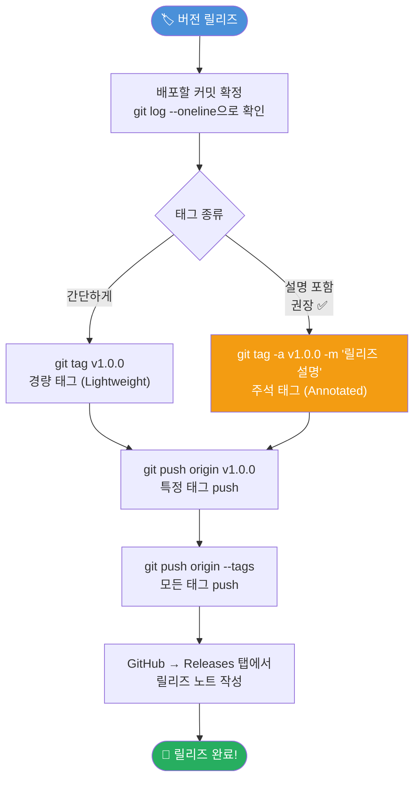

### 💡 태그 명령어 요약

```bash
# 🏷️ 태그 생성
git tag v1.0.0                            # 경량 태그
git tag -a v1.0.0 -m "첫 번째 릴리즈"   # 주석 태그 (권장)
git tag -a v1.0.0 커밋해시              # 특정 커밋에 태그 달기

# 📋 태그 확인
git tag                                    # 태그 목록
git show v1.0.0                           # 태그 상세 정보

# 🚀 태그 push
git push origin v1.0.0                    # 특정 태그 push
git push origin --tags                    # 모든 태그 push

# 🗑️ 태그 삭제
git tag -d v1.0.0                         # 로컬 태그 삭제
git push origin --delete v1.0.0          # 원격 태그 삭제
```

> 💡 **Semantic Versioning**: `v메이저.마이너.패치` (예: v1.2.3)
> - `메이저`: 하위 호환 불가능한 변경
> - `마이너`: 하위 호환 새 기능 추가
> - `패치`: 버그 수정

---

## 11. Pull Request 흐름

> GitHub에서 코드 리뷰를 받고 main에 합치는 흐름

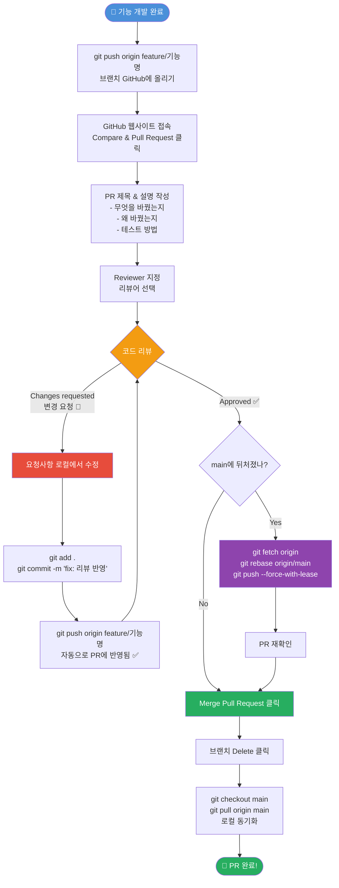

### 🚨 PR 비상 매뉴얼

```bash
# ❌ PR을 잘못된 브랜치로 날렸다!
# GitHub 웹에서 PR 페이지 → Edit → base 브랜치 변경 가능

# ❌ PR 올린 후 main에 새 커밋이 쌓여 브랜치가 뒤처졌다!
git checkout feature/기능명
git fetch origin
git rebase origin/main
git push origin feature/기능명 --force-with-lease

# ❌ Merge했는데 버그가 생겼다! 빨리 되돌려야 한다!
git log --oneline                        # 머지 커밋 해시 확인
git revert -m 1 머지커밋해시            # 머지 커밋 자체를 revert
git push origin main
```

---

## 12. 🚨 비상 매뉴얼

> 상황별로 바로 찾아서 쓸 수 있는 긴급 처방전

### 🔥 파일 실수 처방

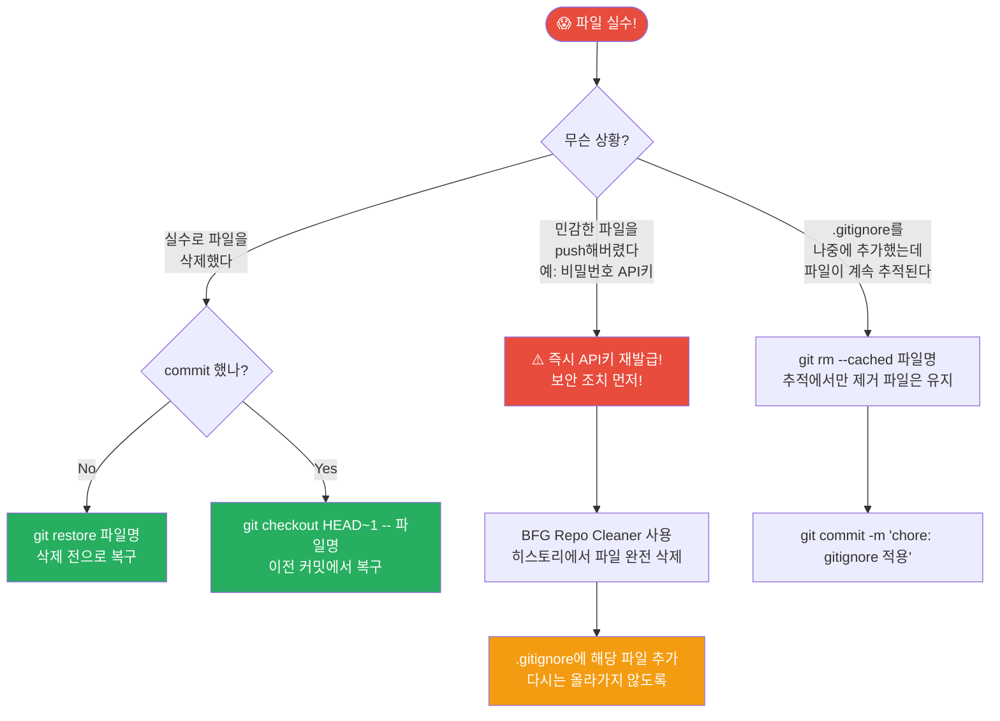

### 🔥 기타 긴급 처방 모음

```bash
# 🆘 방금 git reset --hard 실수! 다 날아갔다!
git reflog                             # 모든 작업 기록 확인 (30일 보존)
git reset --hard HEAD@{n}             # n번 이전 상태로 복구

# 🆘 로컬 브랜치를 원격이랑 강제로 똑같이 맞추고 싶다!
git fetch origin
git reset --hard origin/main          # ⚠️ 로컬 변경사항 모두 사라짐

# 🆘 엉뚱한 브랜치에 커밋했다!
git log --oneline                     # 커밋 해시 복사
git checkout 올바른브랜치
git cherry-pick 커밋해시              # 원하는 커밋 가져오기
git checkout 잘못된브랜치
git reset HEAD~1                      # 잘못된 브랜치에서 제거

# 🆘 작업 중인데 급하게 다른 브랜치 가야 한다!
git stash                             # 현재 작업 임시 저장
git checkout 다른브랜치
# ... 다른 작업 후 원래 브랜치로 돌아와서
git stash pop                         # 임시 작업 복원

# 🆘 push 후 커밋을 통째로 없애야 한다! (혼자 작업하는 브랜치)
git reset --hard HEAD~1
git push --force-with-lease          # 협업 브랜치에서는 절대 금지!
```

---

## 🔖 전체 명령어 Quick Reference

```bash
# ═══════════════ 시작 ═══════════════
git init                               # 새 저장소 초기화
git clone URL                          # 저장소 복제
git remote add origin URL              # 원격 저장소 연결
git remote -v                          # 원격 저장소 확인

# ═══════════════ 상태 확인 ═══════════
git status                             # 현재 상태
git log --oneline --graph --all        # 전체 브랜치 그래프
git diff                               # unstaged 변경사항
git diff --staged                      # staged 변경사항

# ═══════════════ 스테이징 & 커밋 ═════
git add .                              # 전체 스테이징
git add 파일명                         # 개별 스테이징
git add -p                             # 대화형 스테이징
git commit -m "feat: 내용"            # 커밋
git commit -am "fix: 내용"            # add + commit (tracked만)
git commit --amend -m "새 메시지"     # 직전 커밋 수정

# ═══════════════ 브랜치 ══════════════
git branch                             # 목록 확인
git checkout -b 브랜치명              # 생성 + 이동
git checkout 브랜치명                  # 이동
git merge 브랜치명                     # 현재 브랜치에 병합
git rebase main                        # 리베이스
git branch -d 브랜치명                # 삭제

# ═══════════════ 원격 동기화 ══════════
git fetch origin                       # 가져오기 (merge 안 함)
git pull origin main                   # 가져오고 병합
git push origin 브랜치명              # 업로드

# ═══════════════ 되돌리기 ════════════
git restore 파일명                     # 수정 취소 (add 전)
git restore --staged 파일명           # 스테이지에서 내리기
git reset --soft HEAD~1               # 커밋 취소, staged 유지
git reset HEAD~1                       # 커밋 취소, 파일 유지
git reset --hard HEAD~1               # 커밋 + 파일 모두 취소 ⚠️
git revert HEAD                        # 안전한 되돌리기 (push 후)

# ═══════════════ Stash ═══════════════
git stash                              # 임시 저장
git stash pop                          # 복원 + 스택 제거
git stash list                         # 목록 확인

# ═══════════════ 태그 ════════════════
git tag -a v1.0.0 -m "설명"          # 주석 태그 생성
git push origin --tags                 # 태그 push
```